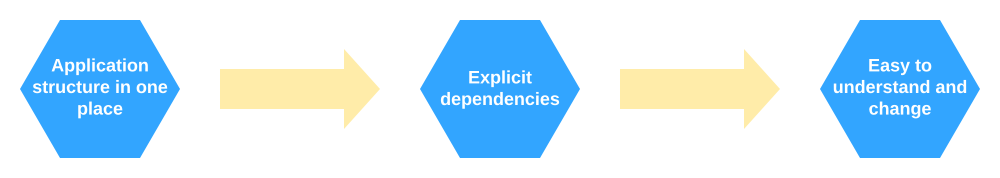

.. figure:: https://raw.githubusercontent.com/wiki/ets-labs/python-dependency-injector/img/logo.svg
   :target: https://github.com/ets-labs/python-dependency-injector

| 

.. image:: https://img.shields.io/pypi/v/dependency_injector.svg
   :target: https://pypi.org/project/dependency-injector/
   :alt: Latest Version
   
.. image:: https://img.shields.io/pypi/l/dependency_injector.svg
   :target: https://pypi.org/project/dependency-injector/
   :alt: License
   
.. image:: https://pepy.tech/badge/dependency-injector
   :target: https://pepy.tech/project/dependency-injector
   :alt: Downloads
   
.. image:: https://img.shields.io/pypi/pyversions/dependency_injector.svg
   :target: https://pypi.org/project/dependency-injector/
   :alt: Supported Python versions
   
.. image:: https://img.shields.io/pypi/implementation/dependency_injector.svg
   :target: https://pypi.org/project/dependency-injector/
   :alt: Supported Python implementations
   
.. image:: https://travis-ci.org/ets-labs/python-dependency-injector.svg?branch=master
   :target: https://travis-ci.org/ets-labs/python-dependency-injector
   :alt: Build Status
   
.. image:: http://readthedocs.org/projects/python-dependency-injector/badge/?version=latest
   :target: http://python-dependency-injector.ets-labs.org/
   :alt: Docs Status
   
.. image:: https://coveralls.io/repos/github/ets-labs/python-dependency-injector/badge.svg?branch=master
   :target: https://coveralls.io/github/ets-labs/python-dependency-injector?branch=master
   :alt: Coverage Status

What is ``Dependency Injector``?
================================

``Dependency Injector`` is a dependency injection framework for Python.

Why do I need it?
=================

``Dependency Injector`` helps you improve application structure.

With the ``Dependency Injector`` you keep **application structure in one place**.
This place is called **the container**. You use the container to manage all the components of the application. All the component dependencies are defined explicitly. This provides the control on the application structure. It is **easy to understand and change** it.

*The container is like a map of your application. You always know what depends on what.*

Example:

.. code-block:: python

    import sqlite3

    import boto3
    from dependency_injector import containers, providers
    
    from .example import services

    class Application(containers.DeclarativeContainer):
        """Application container."""

        config = providers.Configuration()

        # Gateways

        database_client = providers.Singleton(sqlite3.connect, config.database.dsn)

        s3_client = providers.Singleton(
            boto3.client, 's3',
            aws_access_key_id=config.aws.access_key_id,
            aws_secret_access_key=config.aws.secret_access_key,
        )

        # Services

        users_service = providers.Factory(
            services.UsersService,
            db=database_client,
        )

        auth_service = providers.Factory(
            services.AuthService,
            token_ttl=config.auth.token_ttl,
            db=database_client,
        )

        photos_service = providers.Factory(
            services.PhotosService,
            db=database_client,
            s3=s3_client,
        )

Run the application:

.. code-block:: python

    from .application import Application
    
    
    def main():
       """Run application."""
       application = Application()
       application.config.from_yaml('config.yml')
       
       users_service = application.users_service()
       auth_service = application.auth_service()
       photos_service = application.photos_service()

       ...

    if __name__ == '__main__':
        main()

You can find more ``Dependency Injector`` examples in the ``/examples`` directory
on the GitHub:

    https://github.com/ets-labs/python-dependency-injector

How to install?
---------------

- The package is available on the `PyPi`_::

    pip install dependency-injector

Where is the docs?
------------------

- The documentation is available on the `Read The Docs <http://python-dependency-injector.ets-labs.org/>`_

Have a question?
----------------

- Open a `Github Issue <https://github.com/ets-labs/python-dependency-injector/issues>`_

Want to help?
-------------

- ⭐️ Star the ``Dependency Injector`` on the `Github <https://github.com/ets-labs/python-dependency-injector/>`_
- 🆕 Start a new project with the ``Dependency Injector``
- 💬 Tell your friend about the ``Dependency Injector``

.. _PyPi: https://pypi.org/project/dependency-injector/
