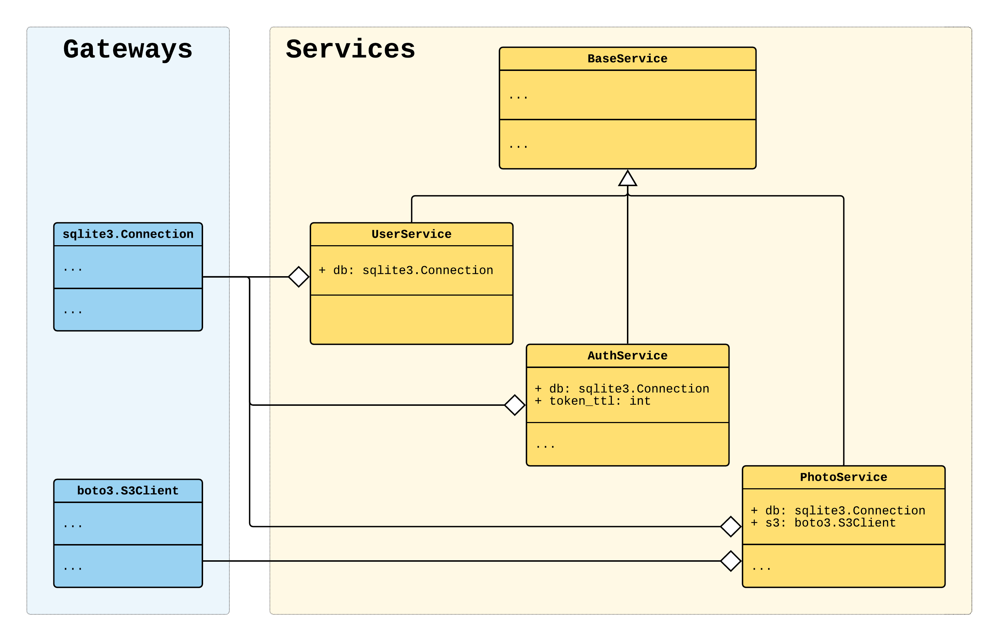

.. _application-multiple-containers:

Application example (multiple containers)
=========================================

.. meta::
   :keywords: Python,Dependency Injection,Inversion of Control,Container,Example,Application,
              Framework,AWS,boto3,client
   :description: This example shows how you can create an application using multiple declarative
                 containers. We build an example Python micro application following the dependency
                 injection principle. It consists from several services with a domain logic that
                 have dependencies on database & AWS S3.

This example shows how you can create an application using multiple declarative containers. Using
multiple declarative containers is a good choice for a large application. For
building a moderate or a small size application refer to :ref:`application-single-container`.

We build an example micro application following the dependency injection principle. It consists
of several services with a domain logic. The services have dependencies on database & AWS S3.

Start from the scratch or jump to the section:

.. contents::
   :local:
   :backlinks: none

You can find the source code and instructions for running on the `Github <https://github.com/ets-labs/python-dependency-injector/tree/master/examples/miniapps/application-multiple-containers>`_.

Application structure
---------------------

Application consists of an ``example`` package, a configuration file and a ``requirements.txt``
file.

.. code-block:: bash

   ./
   ├── example/
   │   ├── __init__.py
   │   ├── __main__.py
   │   ├── containers.py
   │   └── services.py
   ├── config.yml
   └── requirements.txt

Containers
----------

Listing of the ``example/containers.py``:

.. literalinclude:: ../../examples/miniapps/application-multiple-containers/example/containers.py
   :language: python

Main module
-----------

Listing of the ``example/__main__.py``:

.. literalinclude:: ../../examples/miniapps/application-multiple-containers/example/__main__.py
   :language: python

Services
--------

Listing of the ``example/services.py``:

.. literalinclude:: ../../examples/miniapps/application-multiple-containers/example/services.py
   :language: python

Configuration
-------------

Listing of the ``config.yml``:

.. literalinclude:: ../../examples/miniapps/application-multiple-containers/config.yml
   :language: yaml

Run the application
-------------------

You can find the source code and instructions for running on the `Github <https://github.com/ets-labs/python-dependency-injector/tree/master/examples/miniapps/application-multiple-containers>`_.

.. include:: ../sponsor.rst

.. disqus::