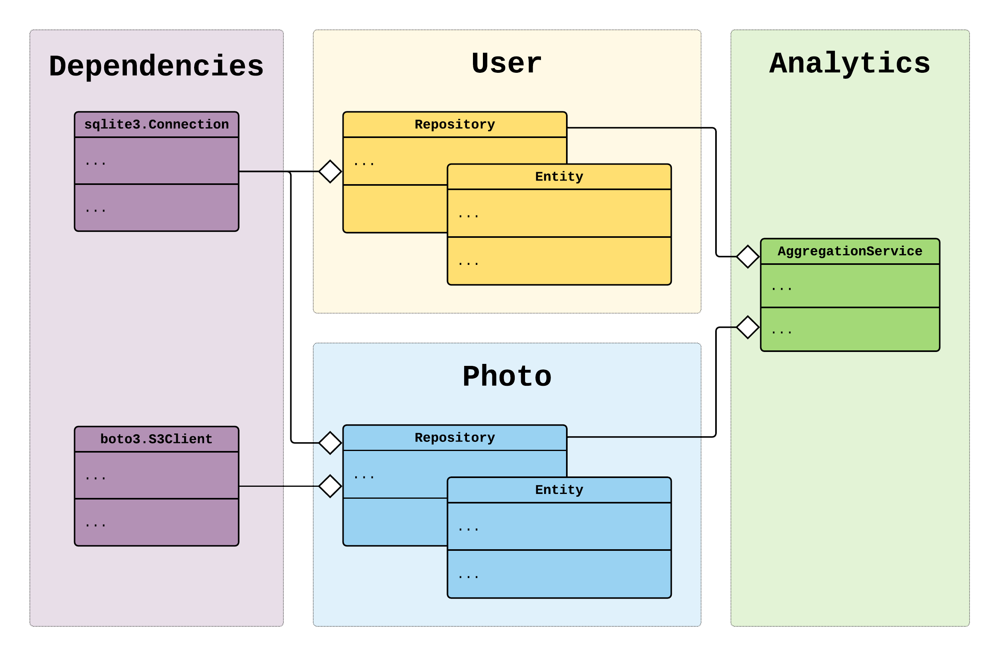

.. _decoupled-packages:

Decoupled packages example (multiple containers)
================================================

.. meta::
   :keywords: Python,Dependency Injection,Inversion of Control,Container,Example,Application,
              Framework,AWS,boto3,client
   :description: This example shows how to use Dependency Injector to create Python decoupled packages.
                 To achieve a decoupling each package has a container with the components. When
                 a component needs a dependency from the outside of the package scope we use the
                 Dependency provider. The package container has no knowledge on where the
                 dependencies come from. It states a need that the dependencies must be provided.
                 This helps to decouple a package from the 3rd party dependencies and other
                 packages.

This example shows how to use ``Dependency Injector`` to create decoupled packages.

To achieve a decoupling each package has a container with the components. When a component needs a
dependency from the outside of the package scope we use the ``Dependency`` provider. The package
container has no knowledge on where the dependencies come from. It states a need that the
dependencies must be provided. This helps to decouple a package from the 3rd party dependencies
and other packages.

To wire the packages we use an application container. Application container has all 3rd party
dependencies and package containers. It wires the packages and dependencies to create a
complete application.

We build an example micro application that consists of 3 packages:

- ``user`` - a package with user domain logic, depends on a database
- ``photo`` - a package with photo domain logic, depends on a database and AWS S3
- ``analytics`` - a package with analytics domain logic, depends on the  ``user`` and ``photo``
  package components

Start from the scratch or jump to the section:

.. contents::
   :local:
   :backlinks: none

You can find the source code and instructions for running on the `Github <https://github.com/ets-labs/python-dependency-injector/tree/master/examples/miniapps/decoupled-packages>`_.

Application structure
---------------------

Application consists of an ``example`` package, a configuration file and a ``requirements.txt``
file.

.. code-block:: bash

   ./
   ├── example/
   │   ├── analytics/
   │   │   ├── __init__.py
   │   │   ├── containers.py
   │   │   └── services.py
   │   ├── photo/
   │   │   ├── __init__.py
   │   │   ├── containers.py
   │   │   ├── entities.py
   │   │   └── repositories.py
   │   ├── user/
   │   │   ├── __init__.py
   │   │   ├── containers.py
   │   │   ├── entities.py
   │   │   └── repositories.py
   │   ├── __init__.py
   │   ├── __main__.py
   │   └── containers.py
   ├── config.ini
   └── requirements.txt

Package containers
------------------

Listing of the ``example/user/containers.py``:

.. literalinclude:: ../../examples/miniapps/decoupled-packages/example/user/containers.py
   :language: python

Listing of the ``example/photo/containers.py``:

.. literalinclude:: ../../examples/miniapps/decoupled-packages/example/photo/containers.py
   :language: python

Listing of the ``example/analytics/containers.py``:

.. literalinclude:: ../../examples/miniapps/decoupled-packages/example/analytics/containers.py
   :language: python

Application container
---------------------

Application container consists of all packages and 3rd party dependencies. Its role is to wire
everything together in a complete application.

Listing of the ``example/containers.py``:

.. literalinclude:: ../../examples/miniapps/decoupled-packages/example/containers.py
   :language: python

.. note::
   Package ``analytics`` has dependencies on the repositories from the ``user`` and
   ``photo`` packages. This is an example of how you can pass the dependencies from one package
   to another.

Main module
-----------
Listing of the ``example/__main__.py``:

.. literalinclude:: ../../examples/miniapps/decoupled-packages/example/__main__.py
   :language: python

Configuration
-------------

Listing of the ``config.ini``:

.. literalinclude:: ../../examples/miniapps/decoupled-packages/config.ini
   :language: ini

Run the application
-------------------

You can find the source code and instructions for running on the `Github <https://github.com/ets-labs/python-dependency-injector/tree/master/examples/miniapps/decoupled-packages>`_.

.. include:: ../sponsor.rst

.. disqus::
