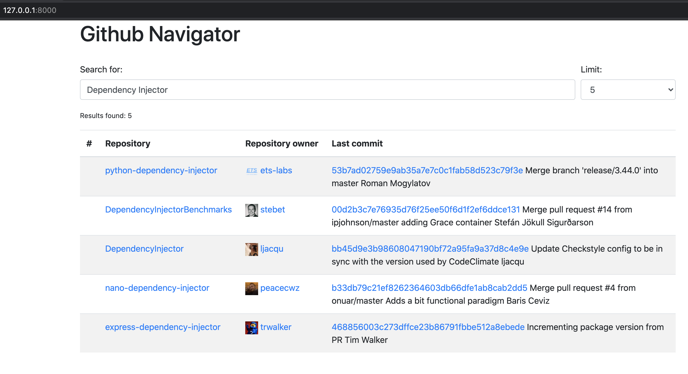

.. _django-example:

Django example
==============

.. meta::
   :keywords: Python,Dependency Injection,Django,Example
   :description: This example demonstrates a usage of the Django and Dependency Injector.

This example shows how to use ``Dependency Injector`` with `Django <https://www.djangoproject.com/>`_.

The example application helps to search for repositories on the Github.

The source code is available on the `Github <https://github.com/ets-labs/python-dependency-injector/tree/master/examples/miniapps/django>`_.

Application structure
---------------------

Application has standard Django project structure. It consists of ``githubnavigator`` project package and
``web`` application package:

.. code-block:: bash

   ./
   ├── githubnavigator/
   │   ├── __init__.py
   │   ├── asgi.py
   │   ├── containers.py
   │   ├── services.py
   │   ├── settings.py
   │   ├── urls.py
   │   └── wsgi.py
   ├── web/
   │   ├── templates/
   │   │   ├── base.html
   │   │   └── index.html
   │   ├── __init__.py
   │   ├── apps.py
   │   ├── tests.py
   │   ├── urls.py
   │   └── views.py
   ├── manage.py
   └── requirements.txt

Container
---------

Declarative container is defined in ``githubnavigator/containers.py``:

.. literalinclude:: ../../examples/miniapps/django/githubnavigator/containers.py
   :language: python

Container instance is created in ``githubnavigator/__init__.py``:

.. literalinclude:: ../../examples/miniapps/django/githubnavigator/__init__.py
   :language: python

Views
-----

View has dependencies on search service and some config options. The dependencies are injected
using :ref:`wiring` feature.

Listing of ``web/views.py``:

.. literalinclude:: ../../examples/miniapps/django/web/views.py
   :language: python

App config
----------

Container is wired to the ``views`` module in the app config ``web/apps.py``:

.. literalinclude:: ../../examples/miniapps/django/web/apps.py
   :language: python
   :emphasize-lines: 13

Tests
-----

Tests use :ref:`provider-overriding` feature to replace github client with a mock ``web/tests.py``:

.. literalinclude:: ../../examples/miniapps/django/web/tests.py
   :language: python
   :emphasize-lines: 39,60

Sources
-------

Explore the sources on the `Github <https://github.com/ets-labs/python-dependency-injector/tree/master/examples/miniapps/django>`_.

.. include:: ../sponsor.rst

.. disqus::
