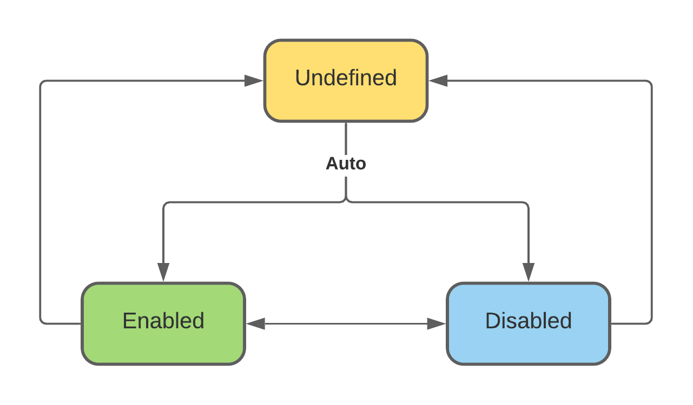

.. _async-injections:

Asynchronous injections
=======================

.. meta::
   :keywords: Python,DI,Dependency injection,IoC,Inversion of Control,Providers,Async,Injections,Asynchronous,Await,
              Asyncio
   :description: Dependency Injector providers support asynchronous injections. This page
                 demonstrates how make asynchronous dependency injections in Python.

Providers support asynchronous injections.

.. literalinclude:: ../../examples/providers/async.py
   :language: python
   :emphasize-lines: 26-29
   :lines: 3-

If provider has any awaitable injections it switches into async mode. In async mode provider always returns awaitable.
This causes a cascade effect:

.. code-block:: bash

   provider1()              <── Async mode enabled <──┐
   │                                                  │
   ├──> provider2()                                   │
   │                                                  │
   ├──> provider3()         <── Async mode enabled <──┤
   │    │                                             │
   │    └──> provider4()    <── Async provider ───────┘
   │
   └──> provider5()
        │
        └──> provider6()

In async mode provider prepares injections asynchronously.

If provider has multiple awaitable dependencies, it will run them concurrently. Provider will wait until all
dependencies are ready and inject them afterwards.

.. code-block:: bash

   provider1()
   │
   ├──> provider2()         <── Async mode enabled
   │
   ├──> provider3()         <── Async mode enabled
   │
   └──> provider4()         <── Async mode enabled

Here is what provider will do for the previous example:

.. code-block:: python

   injections = await asyncio.gather(
       provider2(),
       provider3(),
       provider4(),
   )
   await provider1(*injections)

Overriding behaviour
--------------------

In async mode provider always returns awaitable. It applies to the overriding too. If provider in async mode is
overridden by a provider that doesn't return awaitable result, the result will be wrapped into awaitable.

.. literalinclude:: ../../examples/providers/async_overriding.py
   :language: python
   :emphasize-lines: 19-24
   :lines: 3-

Async mode mechanics and API
----------------------------

By default provider's async mode is undefined.

When provider async mode is undefined, provider will automatically select the mode during the next call.
If the result is awaitable, provider will enable async mode, if not - disable it.

If provider async mode is enabled, provider always returns awaitable. If the result is not awaitable,
provider wraps it into awaitable explicitly. You can safely ``await`` provider in async mode.

If provider async mode is disabled, provider behaves the regular way. It doesn't do async injections
preparation or non-awaitables to awaitables conversion.

Once provider async mode is enabled or disabled, provider will stay in this state. No automatic switching
will be done.

You can also use following methods to change provider's async mode manually:

- ``Provider.enable_async_mode()``
- ``Provider.disable_async_mode()``
- ``Provider.reset_async_mode()``

To check the state of provider's async mode use:

- ``Provider.is_async_mode_enabled()``
- ``Provider.is_async_mode_disabled()``
- ``Provider.is_async_mode_undefined()``

See also:

- Wiring :ref:`async-injections-wiring`
- Resource provider :ref:`resource-async-initializers`
- :ref:`fastapi-redis-example`

.. disqus::
