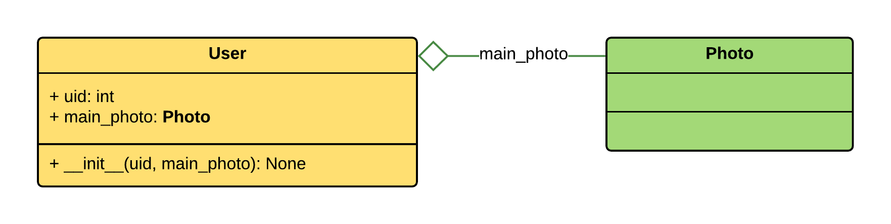
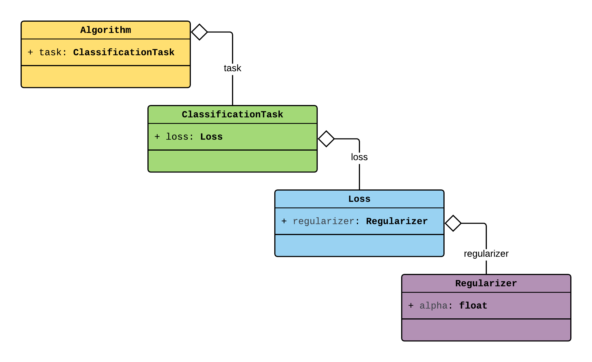
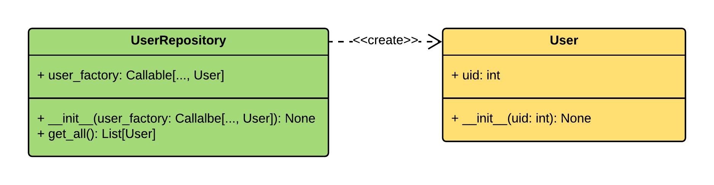
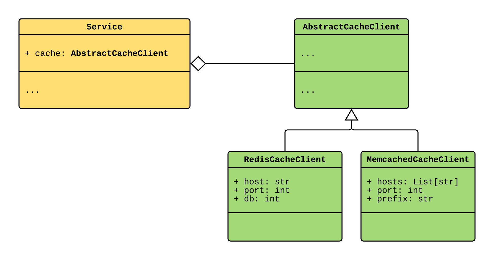
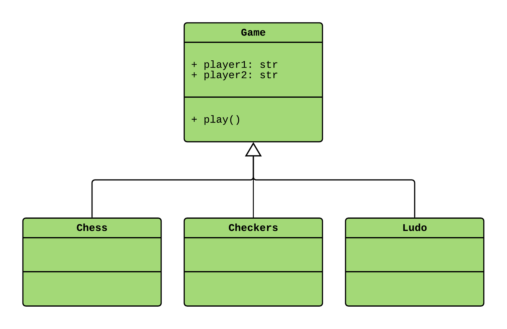

Factory provider
----------------

.. meta::
   :keywords: Python,DI,Dependency injection,IoC,Inversion of Control,Factory,Abstract Factory,
              Pattern,Example,Aggregate
   :description: Factory provider helps to implement dependency injection in Python. This page
                 demonstrates how to use Factory provider, inject the dependencies, and assemble
                 object graphs passing the injections deep inside. It also provides the examples
                 of the Abstract Factory pattern & provider and Factories Aggregation pattern.

.. currentmodule:: dependency_injector.providers

:py:class:`Factory` provider creates new objects.

.. literalinclude:: ../../examples/providers/factory.py
   :language: python
   :lines: 3-

The first argument of the ``Factory`` provider is a class, a factory function or a method
that creates an object.

The rest of the ``Factory`` positional and keyword arguments are the dependencies.
``Factory`` injects the dependencies every time when creates a new object. The dependencies are
injected following these rules:

+ If the dependency is a provider, this provider is called and the result of the call is injected.
+ If you need to inject the provider itself, you should use the ``.provider`` attribute. More at
  :ref:`factory_providers_delegation`.
+ All other dependencies are injected *"as is"*.
+ Positional context arguments are appended after ``Factory`` positional dependencies.
+ Keyword context arguments have the priority over the ``Factory`` keyword dependencies with the
  same name.

.. literalinclude:: ../../examples/providers/factory_init_injections.py
   :language: python
   :lines: 3-

Passing arguments to the underlying providers
~~~~~~~~~~~~~~~~~~~~~~~~~~~~~~~~~~~~~~~~~~~~~

``Factory`` provider can pass the arguments to the underlying providers. This helps when you need
to assemble a nested objects graph and pass the arguments deep inside.

Consider the example:

To create an ``Algorithm`` you need to provide all the dependencies: ``ClassificationTask``,
``Loss``, and ``Regularizer``. The last object in the chain, the ``Regularizer`` has a dependency
on the ``alpha`` value. The ``alpha`` value varies from algorithm to algorithm:

.. code-block:: python

   Algorithm(
       task=ClassificationTask(
           loss=Loss(
               regularizer=Regularizer(
                   alpha=alpha,  # <-- the dependency
               ),
           ),
       ),
   )

``Factory`` provider helps to deal with the such assembly. You need to create the factories for
all the classes and use special double-underscore ``__`` syntax for passing the ``alpha`` argument:

.. literalinclude:: ../../examples/providers/factory_init_injections_underlying.py
   :language: python
   :lines: 3-
   :emphasize-lines: 24-35,39,42,45

When you use ``__`` separator in the name of the keyword argument the ``Factory`` looks for
the dependency with the same name as the left part of the ``__`` expression.

.. code-block::

   <dependency>__<keyword for the underlying provider>=<value>

If ``<dependency>`` is found the underlying provider will receive the
``<keyword for the underlying provider>=<value>`` as an argument.

.. _factory_providers_delegation:

Passing providers to the objects
~~~~~~~~~~~~~~~~~~~~~~~~~~~~~~~~

When you need to inject the provider itself, but not the result of its call, use the ``.provider``
attribute of the provider that you're going to inject.

.. literalinclude:: ../../examples/providers/factory_delegation.py
   :language: python
   :lines: 3-
   :emphasize-lines: 25

.. note:: Any provider has a ``.provider`` attribute.

Specializing the provided type
~~~~~~~~~~~~~~~~~~~~~~~~~~~~~~

You can create a specialized ``Factory`` provider that provides only specific type. For doing
this you need to create a subclass of the ``Factory`` provider and define the ``provided_type``
class attribute.

.. literalinclude:: ../../examples/providers/factory_provided_type.py
   :language: python
   :lines: 3-
   :emphasize-lines: 12-14

Abstract factory
~~~~~~~~~~~~~~~~

:py:class:`AbstractFactory` provider helps when you need to create a provider of some base class
and the particular implementation is not yet know. ``AbstractFactory`` provider is a ``Factory``
provider with two peculiarities:

+ Provides only objects of a specified type.
+ Must be overridden before usage.

.. literalinclude:: ../../examples/providers/abstract_factory.py
   :language: python
   :lines: 3-
   :emphasize-lines: 32

Factory aggregate
~~~~~~~~~~~~~~~~~

:py:class:`FactoryAggregate` provider aggregates multiple factories. When you call the
``FactoryAggregate`` it delegates the call to one of the factories.

The aggregated factories are associated with the string names. When you call the
``FactoryAggregate`` you have to provide one of the these names as a first argument.
``FactoryAggregate`` looks for the factory with a matching name and delegates it the work. The
rest of the arguments are passed to the delegated ``Factory``.

.. literalinclude:: ../../examples/providers/factory_aggregate.py
   :language: python
   :lines: 3-
   :emphasize-lines: 31-35,43

You can get a dictionary of the aggregated factories using the ``.factories`` attribute of the
``FactoryAggregate``. To get a game factories dictionary from the previous example you can use
``game_factory.factories`` attribute.

You can also access an aggregated factory as an attribute. To create the ``Chess`` object from the
previous example you can do ``chess = game_factory.chess('John', 'Jane')``.

.. note::
   You can not override the ``FactoryAggregate`` provider.

.. note::
   When you inject the ``FactoryAggregate`` provider it is passed "as is".

.. disqus::
