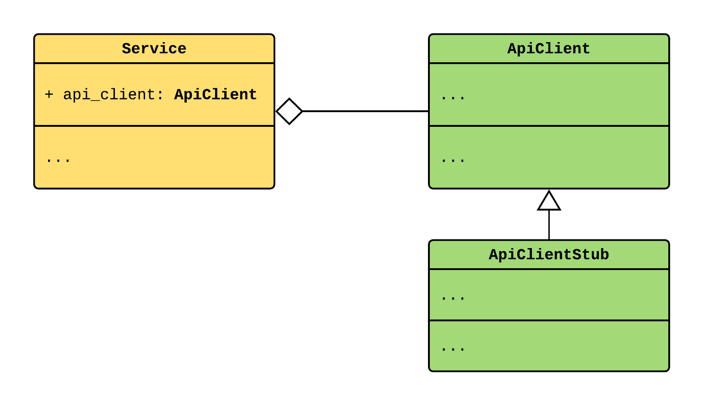

.. _provider-overriding:

Provider overriding
===================

.. meta::
   :keywords: Python,DI,Dependency injection,IoC,Inversion of Control,Override,Test,Unit
   :description: This page demonstrates how to implement providers overriding. This helps in
                 testing and configuring the system for the multiple environments.

.. currentmodule:: dependency_injector.providers

You can override any provider with another provider.

When provider is overridden it calls to the overriding provider instead of providing
the object by its own.

This helps in testing. This also helps in overriding API clients with stubs for the development
or staging environment.

To override a provider you need to call the ``Provider.override()`` method. This method receives
a single argument called ``overriding``.  If the ``overriding`` value is a provider, this provider
is called instead of the original. If value is not a provider, this value is returned instead of
calling the original provider.

.. literalinclude:: ../../examples/providers/overriding.py
   :language: python
   :lines: 3-

You can override a provider multiple times. In that case the latest ``overriding`` value will be
used. The rest of the overriding values will form a stack.

To reset an overriding you can use the ``Provider.reset_override()`` or
``Provider.reset_last_overriding()`` methods.

You can use a context manager for overriding a provider ``with Provider.override():``. The
overriding will be reset when context closed.

.. disqus::
