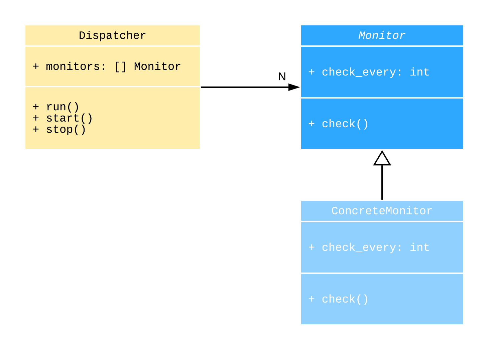

.. _asyncio-daemon-tutorial:

Asyncio daemon tutorial
=======================

.. meta::
   :keywords: Python,asyncio,Daemon,Monitoring,Tutorial,Education,Web,API,REST API,Example,DI,
              Dependency injection,IoC,Inversion of control,Refactoring,Tests,Unit tests,Pytest,
              py.test,docker,docker-compose,backend
   :description: This tutorial shows how to build an asyncio application following the dependency
                 injection principle. You will create the monitoring daemon, use docker &
                 docker-compose, cover the daemon with the unit test and make some refactoring.

This tutorial shows how to build an ``asyncio`` daemon following the dependency injection
principle.

In this tutorial we will use:

- Python 3
- Docker
- Docker Compose

Start from the scratch or jump to the section:

.. contents::
   :local:
   :backlinks: none

You can find complete project on the
`Github <https://github.com/ets-labs/python-dependency-injector/tree/master/examples/miniapps/asyncio-daemon>`_.

What are we going to build?
---------------------------

We will build a monitoring daemon that monitors web services availability.

The daemon will send the requests to the `example.com <http://example.com>`_ and
`httpbin.org <https://httpbin.org>`_ every couple of seconds. For each successfully completed
response it will log:

- The response code
- The amount of bytes in the response
- The time took to complete the response

.. image::  asyncio-images/diagram.png

Prerequisites
-------------

We will use `docker compose <https://docs.docker.com/compose/>`_ in this tutorial. Let's check the versions:

.. code-block:: bash

   docker --version
   docker compose version

The output should look something like:

.. code-block:: bash

   Docker version 27.3.1, build ce12230
   Docker Compose version v2.29.7

.. note::

   If you don't have ``Docker`` or ``docker compose`` you need to install them before proceeding.
   Follow these installation guides:

   - `Install Docker <https://docs.docker.com/get-docker/>`_
   - `Install docker compose <https://docs.docker.com/compose/install/>`_

The prerequisites are satisfied. Let's get started with the project layout.

Project layout
--------------

Create the project root folder and set it as a working directory:

.. code-block:: bash

   mkdir asyncio-daemon-tutorial
   cd asyncio-daemon-tutorial

Now we need to create the initial project structure. Create the files and folders following next
layout. All files should be empty for now. We will fill them later.

Initial project layout:

.. code-block:: bash

   ./
   ├── monitoringdaemon/
   │   ├── __init__.py
   │   ├── __main__.py
   │   └── containers.py
   ├── config.yml
   ├── docker-compose.yml
   ├── Dockerfile
   └── requirements.txt

Initial project layout is ready. We will extend it in the next sections.

Let's proceed to the environment preparation.

Prepare the environment
-----------------------

In this section we are going to prepare the environment for running our daemon.

First we need to specify the project requirements. We will use next packages:

- ``dependency-injector`` - the dependency injection framework
- ``aiohttp`` - the web framework (we need only http client)
- ``pyyaml`` - the YAML files parsing library, used for the reading of the configuration files
- ``pytest`` - the test framework
- ``pytest-asyncio`` - the helper library for the testing of the ``asyncio`` application
- ``pytest-cov`` - the helper library for measuring the test coverage

Put next lines into the ``requirements.txt`` file:

.. code-block:: bash

   dependency-injector
   aiohttp
   pyyaml
   pytest
   pytest-asyncio
   pytest-cov

Second, we need to create the ``Dockerfile``. It will describe the daemon's build process and
specify how to run it. We will use ``python:3.13-bookworm`` as a base image.

Put next lines into the ``Dockerfile`` file:

.. code-block:: bash

   FROM python:3.13-bookworm

   ENV PYTHONUNBUFFERED=1

   WORKDIR /code
   COPY . /code/

   RUN apt-get install openssl \
    && pip install --upgrade pip \
    && pip install -r requirements.txt \
    && rm -rf ~/.cache

   CMD ["python", "-m", "monitoringdaemon"]

Third, we need to define the container in the docker-compose configuration.

Put next lines into the ``docker-compose.yml`` file:

.. code-block:: yaml

   services:

     monitor:
       build: ./
       image: monitoring-daemon
       volumes:
         - "./:/code"

All is ready. Let's check that the environment is setup properly.

Run in the terminal:

.. code-block:: bash

   docker compose build

The build process may take a couple of minutes. You should see something like this in the end:

.. code-block:: bash

   Successfully built 5b4ee5e76e35
   Successfully tagged monitoring-daemon:latest

After the build is done run the container:

.. code-block:: bash

   docker compose up

The output should look like:

.. code-block:: bash

   Creating network "asyncio-daemon-tutorial_default" with the default driver
   Creating asyncio-daemon-tutorial_monitor_1 ... done
   Attaching to asyncio-daemon-tutorial_monitor_1
   asyncio-daemon-tutorial_monitor_1 exited with code 0

The environment is ready. The application does not do any work and just exits with a code ``0``.

Next step is to configure the logging and configuration file parsing.

Logging and configuration
-------------------------

In this section we will configure the logging and configuration file parsing.

Let's start with the the main part of our application – the container. Container will keep all of
the application components and their dependencies.

First two components that we're going to add are the configuration provider and the resource provider
for configuring the logging.

Put next lines into the ``containers.py`` file:

.. code-block:: python

   """Containers module."""

   import logging
   import sys

   from dependency_injector import containers, providers

   class Container(containers.DeclarativeContainer):

       config = providers.Configuration(yaml_files=["config.yml"])

       logging = providers.Resource(
           logging.basicConfig,
           stream=sys.stdout,
           level=config.log.level,
           format=config.log.format,
       )

The configuration file will keep the logging settings. Put next lines into the ``config.yml`` file:

.. code-block:: yaml

   log:
     level: "INFO"
     format: "[%(asctime)s] [%(levelname)s] [%(name)s]: %(message)s"

Now let's create the function that will run our daemon. It's traditionally called ``main()``.
The ``main()`` function will start the dispatcher, but we will keep it empty for now.
We will create the container instance before calling ``main()`` in ``if __name__ == "__main__"``.
Container instance will parse ``config.yml`` and then we will call the logging configuration provider.

Put next lines into the ``__main__.py`` file:

.. code-block:: python

   """Main module."""

   from .containers import Container

   def main() -> None:
       ...

   if __name__ == "__main__":
       container = Container()
       container.init_resources()

       main()

.. note::

   Container is the first object in the application.

Logging and configuration parsing part is done. In next section we will create the monitoring
checks dispatcher.

Dispatcher
----------

Now let's add the monitoring checks dispatcher.

The dispatcher will control a list of the monitoring tasks. It will execute each task according
to the configured schedule. The ``Monitor`` class is the base class for all the monitors. You can
create different monitors by subclassing it and implementing the ``check()`` method.

Let's create dispatcher and the monitor base classes.

Create ``dispatcher.py`` and ``monitors.py`` in the ``monitoringdaemon`` package:

.. code-block:: bash
   :emphasize-lines: 6-7

   ./
   ├── monitoringdaemon/
   │   ├── __init__.py
   │   ├── __main__.py
   │   ├── containers.py
   │   ├── dispatcher.py
   │   └── monitors.py
   ├── config.yml
   ├── docker-compose.yml
   ├── Dockerfile
   └── requirements.txt

Put next into the ``monitors.py``:

.. code-block:: python

   """Monitors module."""

   import logging

   class Monitor:

       def __init__(self, check_every: int) -> None:
           self.check_every = check_every
           self.logger = logging.getLogger(self.__class__.__name__)

       async def check(self) -> None:
           raise NotImplementedError()

and next into the ``dispatcher.py``:

.. code-block:: python

   """Dispatcher module."""

   import asyncio
   import logging
   import signal
   import time
   from typing import List

   from .monitors import Monitor

   class Dispatcher:

       def __init__(self, monitors: List[Monitor]) -> None:
           self._monitors = monitors
           self._monitor_tasks: List[asyncio.Task] = []
           self._logger = logging.getLogger(self.__class__.__name__)
           self._stopping = False

       def run(self) -> None:
           asyncio.run(self.start())

       async def start(self) -> None:
           self._logger.info("Starting up")

           for monitor in self._monitors:
               self._monitor_tasks.append(
                   asyncio.create_task(self._run_monitor(monitor)),
               )

           asyncio.get_event_loop().add_signal_handler(signal.SIGTERM, self.stop)
           asyncio.get_event_loop().add_signal_handler(signal.SIGINT, self.stop)

           await asyncio.gather(*self._monitor_tasks, return_exceptions=True)

           self.stop()

       def stop(self) -> None:
           if self._stopping:
               return

           self._stopping = True

           self._logger.info("Shutting down")
           for task, monitor in zip(self._monitor_tasks, self._monitors):
               task.cancel()
           self._monitor_tasks.clear()
           self._logger.info("Shutdown finished successfully")

       @staticmethod
       async def _run_monitor(monitor: Monitor) -> None:
           def _until_next(last: float) -> float:
               time_took = time.time() - last
               return monitor.check_every - time_took

           while True:
               time_start = time.time()

               try:
                   await monitor.check()
               except asyncio.CancelledError:
                   break
               except Exception:
                   monitor.logger.exception("Error executing monitor check")

               await asyncio.sleep(_until_next(last=time_start))

Now we need to add the dispatcher to the container.

Edit ``containers.py``:

.. code-block:: python
   :emphasize-lines: 8,22-27

   """Containers module."""

   import logging
   import sys

   from dependency_injector import containers, providers

   from . import dispatcher

   class Container(containers.DeclarativeContainer):

       config = providers.Configuration(yaml_files=["config.yml"])

       logging = providers.Resource(
           logging.basicConfig,
           stream=sys.stdout,
           level=config.log.level,
           format=config.log.format,
       )

       dispatcher = providers.Factory(
           dispatcher.Dispatcher,
           monitors=providers.List(
               # TODO: add monitors
           ),
       )

At the last we will inject dispatcher into the ``main()`` function
and call the ``run()`` method. We will use :ref:`wiring` feature.

Edit ``__main__.py``:

.. code-block:: python
   :emphasize-lines: 3-5,9-11,17

   """Main module."""

   from dependency_injector.wiring import Provide, inject

   from .dispatcher import Dispatcher
   from .containers import Container

   @inject
   def main(dispatcher: Dispatcher = Provide[Container.dispatcher]) -> None:
       dispatcher.run()

   if __name__ == "__main__":
       container = Container()
       container.init_resources()
       container.wire(modules=[__name__])

       main()

Finally let's start the daemon to check that all works.

Run in the terminal:

.. code-block:: bash

   docker compose up

The output should look like:

.. code-block:: bash

   Starting asyncio-daemon-tutorial_monitor_1 ... done
   Attaching to asyncio-daemon-tutorial_monitor_1
   monitor_1  | [2020-08-08 16:12:35,772] [INFO] [Dispatcher]: Starting up
   monitor_1  | [2020-08-08 16:12:35,774] [INFO] [Dispatcher]: Shutting down
   monitor_1  | [2020-08-08 16:12:35,774] [INFO] [Dispatcher]: Shutdown finished successfully
   asyncio-daemon-tutorial_monitor_1 exited with code 0

Everything works properly. Dispatcher starts up and exits because there are no monitoring tasks.

By the end of this section we have the application skeleton ready. In next section will will
add first monitoring task.

Example.com monitor
-------------------

In this section we will add a monitoring task that will check the availability of the
`http://example.com <http://example.com>`_.

We will start from the extending of our class model with a new type of the monitoring check, the
``HttpMonitor``.

The ``HttpMonitor`` is a subclass of the ``Monitor``. We will implement the ``check()`` method that
will send the HTTP request to the specified URL. The http request sending will be delegated to
the ``HttpClient``.

.. image:: asyncio-images/classes-02.png

First we need to create the ``HttpClient``.

Create ``http.py`` in the ``monitoringdaemon`` package:

.. code-block:: bash
   :emphasize-lines: 7

   ./
   ├── monitoringdaemon/
   │   ├── __init__.py
   │   ├── __main__.py
   │   ├── containers.py
   │   ├── dispatcher.py
   │   ├── http.py
   │   └── monitors.py
   ├── config.yml
   ├── docker-compose.yml
   ├── Dockerfile
   └── requirements.txt

and put next into it:

.. code-block:: python

   """Http client module."""

   from aiohttp import ClientSession, ClientTimeout, ClientResponse

   class HttpClient:

       async def request(self, method: str, url: str, timeout: int) -> ClientResponse:
           async with ClientSession(timeout=ClientTimeout(timeout)) as session:
               async with session.request(method, url) as response:
                   return response

Now we need to add the ``HttpClient`` to the container.

Edit ``containers.py``:

.. code-block:: python
   :emphasize-lines: 8,22

   """Containers module."""

   import logging
   import sys

   from dependency_injector import containers, providers

   from . import http, dispatcher

   class Container(containers.DeclarativeContainer):

       config = providers.Configuration(yaml_files=["config.yml"])

       logging = providers.Resource(
           logging.basicConfig,
           stream=sys.stdout,
           level=config.log.level,
           format=config.log.format,
       )

       http_client = providers.Factory(http.HttpClient)

       dispatcher = providers.Factory(
           dispatcher.Dispatcher,
           monitors=providers.List(
               # TODO: add monitors
           ),
       )

Now we're ready to add the ``HttpMonitor``. We will add it to the ``monitors`` module.

Edit ``monitors.py``:

.. code-block:: python
   :emphasize-lines: 4-7,20-56

   """Monitors module."""

   import logging
   import time
   from typing import Dict, Any

   from .http import HttpClient

   class Monitor:

       def __init__(self, check_every: int) -> None:
           self.check_every = check_every
           self.logger = logging.getLogger(self.__class__.__name__)

       async def check(self) -> None:
           raise NotImplementedError()

   class HttpMonitor(Monitor):

       def __init__(
               self,
               http_client: HttpClient,
               options: Dict[str, Any],
       ) -> None:
           self._client = http_client
           self._method = options.pop("method")
           self._url = options.pop("url")
           self._timeout = options.pop("timeout")
           super().__init__(check_every=options.pop("check_every"))

       async def check(self) -> None:
           time_start = time.time()

           response = await self._client.request(
               method=self._method,
               url=self._url,
               timeout=self._timeout,
           )

           time_end = time.time()
           time_took = time_end - time_start

           self.logger.info(
               "Check\n"
               "    %s %s\n"
               "    response code: %s\n"
               "    content length: %s\n"
               "    request took: %s seconds",
               self._method,
               self._url,
               response.status,
               response.content_length,
               round(time_took, 3)
           )

We have everything ready to add the `http://example.com <http://example.com>`_ monitoring check.
We make two changes in the container:

- Add the factory provider ``example_monitor``.
- Inject the ``example_monitor`` into the dispatcher.

Edit ``containers.py``:

.. code-block:: python
   :emphasize-lines: 8,24-28,33

   """Containers module."""

   import logging
   import sys

   from dependency_injector import containers, providers

   from . import http, monitors, dispatcher

   class Container(containers.DeclarativeContainer):

       config = providers.Configuration(yaml_files=["config.yml"])

       logging = providers.Resource(
           logging.basicConfig,
           stream=sys.stdout,
           level=config.log.level,
           format=config.log.format,
       )

       http_client = providers.Factory(http.HttpClient)

       example_monitor = providers.Factory(
           monitors.HttpMonitor,
           http_client=http_client,
           options=config.monitors.example,
       )

       dispatcher = providers.Factory(
           dispatcher.Dispatcher,
           monitors=providers.List(
               example_monitor,
           ),
       )

Provider ``example_monitor`` has a dependency on the configuration options. Let's define these
options.

Edit ``config.yml``:

.. code-block:: yaml
   :emphasize-lines: 5-11

   log:
     level: "INFO"
     format: "[%(asctime)s] [%(levelname)s] [%(name)s]: %(message)s"

   monitors:

     example:
       method: "GET"
       url: "http://example.com"
       timeout: 5
       check_every: 5

All set. Start the daemon to check that all works.

Run in the terminal:

.. code-block:: bash

   docker compose up

You should see:

.. code-block:: bash

   Starting asyncio-daemon-tutorial_monitor_1 ... done
   Attaching to asyncio-daemon-tutorial_monitor_1
   monitor_1  | [2020-08-08 17:06:41,965] [INFO] [Dispatcher]: Starting up
   monitor_1  | [2020-08-08 17:06:42,033] [INFO] [HttpMonitor]: Check
   monitor_1  |     GET http://example.com
   monitor_1  |     response code: 200
   monitor_1  |     content length: 648
   monitor_1  |     request took: 0.067 seconds
   monitor_1  | [2020-08-08 17:06:47,040] [INFO] [HttpMonitor]: Check
   monitor_1  |     GET http://example.com
   monitor_1  |     response code: 200
   monitor_1  |     content length: 648
   monitor_1  |     request took: 0.073 seconds

Our daemon can monitor `http://example.com <http://example.com>`_ availability.

Let's add a monitor for the `https://httpbin.org <https://httpbin.org>`_.

Httpbin.org monitor
-------------------

Adding of a monitor for the `https://httpbin.org <https://httpbin.org>`_ will be much
easier because we have all the components ready. We just need to create a new provider
in the container and update the configuration.

Edit ``containers.py``:

.. code-block:: python
   :emphasize-lines: 30-34,40

   """Containers module."""

   import logging
   import sys

   from dependency_injector import containers, providers

   from . import http, monitors, dispatcher

   class Container(containers.DeclarativeContainer):

       config = providers.Configuration(yaml_files=["config.yml"])

       logging = providers.Resource(
           logging.basicConfig,
           stream=sys.stdout,
           level=config.log.level,
           format=config.log.format,
       )

       http_client = providers.Factory(http.HttpClient)

       example_monitor = providers.Factory(
           monitors.HttpMonitor,
           http_client=http_client,
           options=config.monitors.example,
       )

       httpbin_monitor = providers.Factory(
           monitors.HttpMonitor,
           http_client=http_client,
           options=config.monitors.httpbin,
       )

       dispatcher = providers.Factory(
           dispatcher.Dispatcher,
           monitors=providers.List(
               example_monitor,
               httpbin_monitor,
           ),
       )

Edit ``config.yml``:

.. code-block:: yaml
   :emphasize-lines: 13-17

   log:
     level: "INFO"
     format: "[%(asctime)s] [%(levelname)s] [%(name)s]: %(message)s"

   monitors:

     example:
       method: "GET"
       url: "http://example.com"
       timeout: 5
       check_every: 5

     httpbin:
       method: "GET"
       url: "https://httpbin.org/get"
       timeout: 5
       check_every: 5

Let's start the daemon and check the logs.

Run in the terminal:

.. code-block:: bash

   docker compose up

You should see:

.. code-block:: bash

   Starting asyncio-daemon-tutorial_monitor_1 ... done
   Attaching to asyncio-daemon-tutorial_monitor_1
   monitor_1  | [2020-08-08 18:09:08,540] [INFO] [Dispatcher]: Starting up
   monitor_1  | [2020-08-08 18:09:08,618] [INFO] [HttpMonitor]: Check
   monitor_1  |     GET http://example.com
   monitor_1  |     response code: 200
   monitor_1  |     content length: 648
   monitor_1  |     request took: 0.077 seconds
   monitor_1  | [2020-08-08 18:09:08,722] [INFO] [HttpMonitor]: Check
   monitor_1  |     GET https://httpbin.org/get
   monitor_1  |     response code: 200
   monitor_1  |     content length: 310
   monitor_1  |     request took: 0.18 seconds
   monitor_1  | [2020-08-08 18:09:13,619] [INFO] [HttpMonitor]: Check
   monitor_1  |     GET http://example.com
   monitor_1  |     response code: 200
   monitor_1  |     content length: 648
   monitor_1  |     request took: 0.066 seconds
   monitor_1  | [2020-08-08 18:09:13,681] [INFO] [HttpMonitor]: Check
   monitor_1  |     GET https://httpbin.org/get
   monitor_1  |     response code: 200
   monitor_1  |     content length: 310
   monitor_1  |     request took: 0.126 seconds

The functional part is done. Daemon monitors `http://example.com <http://example.com>`_  and
`https://httpbin.org <https://httpbin.org>`_.

In next section we will add some tests.

Tests
-----

In this section we will add some tests.

We will use `pytest <https://docs.pytest.org/en/stable/>`_ and
`coverage <https://coverage.readthedocs.io/>`_.

Create ``tests.py`` in the ``monitoringdaemon`` package:

.. code-block:: bash
   :emphasize-lines: 9

   ./
   ├── monitoringdaemon/
   │   ├── __init__.py
   │   ├── __main__.py
   │   ├── containers.py
   │   ├── dispatcher.py
   │   ├── http.py
   │   ├── monitors.py
   │   └── tests.py
   ├── config.yml
   ├── docker-compose.yml
   ├── Dockerfile
   └── requirements.txt

and put next into it:

.. code-block:: python
   :emphasize-lines: 54,70-73

   """Tests module."""

   import asyncio
   import dataclasses
   from unittest import mock

   import pytest

   from .containers import Container

   @dataclasses.dataclass
   class RequestStub:
       status: int
       content_length: int

   @pytest.fixture
   def container():
       return Container(
           config={
               "log": {
                   "level": "INFO",
                   "formant": "[%(asctime)s] [%(levelname)s] [%(name)s]: %(message)s",
               },
               "monitors": {
                   "example": {
                       "method": "GET",
                       "url": "http://fake-example.com",
                       "timeout": 1,
                       "check_every": 1,
                   },
                   "httpbin": {
                       "method": "GET",
                       "url": "https://fake-httpbin.org/get",
                       "timeout": 1,
                       "check_every": 1,
                   },
               },
           }
       )

   @pytest.mark.asyncio
   async def test_example_monitor(container, caplog):
       caplog.set_level("INFO")

       http_client_mock = mock.AsyncMock()
       http_client_mock.request.return_value = RequestStub(
           status=200,
           content_length=635,
       )

       with container.http_client.override(http_client_mock):
           example_monitor = container.example_monitor()
           await example_monitor.check()

       assert "http://fake-example.com" in caplog.text
       assert "response code: 200" in caplog.text
       assert "content length: 635" in caplog.text

   @pytest.mark.asyncio
   async def test_dispatcher(container, caplog, event_loop):
       caplog.set_level("INFO")

       example_monitor_mock = mock.AsyncMock()
       httpbin_monitor_mock = mock.AsyncMock()

       with container.override_providers(
               example_monitor=example_monitor_mock,
               httpbin_monitor=httpbin_monitor_mock,
       ):
           dispatcher = container.dispatcher()
           event_loop.create_task(dispatcher.start())
           await asyncio.sleep(0.1)
           dispatcher.stop()

       assert example_monitor_mock.check.called
       assert httpbin_monitor_mock.check.called

Run in the terminal:

.. code-block:: bash

   docker compose run --rm monitor py.test monitoringdaemon/tests.py --cov=monitoringdaemon

You should see:

.. code-block:: bash

   platform linux -- Python 3.13.1, pytest-8.3.4, pluggy-1.5.0
   rootdir: /code
   plugins: cov-6.0.0, asyncio-0.24.0
   asyncio: mode=Mode.STRICT, default_loop_scope=None
   collected 2 items

   monitoringdaemon/tests.py ..                                    [100%]

   ---------- coverage: platform linux, python 3.10.0-final-0 -----------
   Name                             Stmts   Miss  Cover
   ----------------------------------------------------
   monitoringdaemon/__init__.py         0      0   100%
   monitoringdaemon/__main__.py        11     11     0%
   monitoringdaemon/containers.py      11      0   100%
   monitoringdaemon/dispatcher.py      45      5    89%
   monitoringdaemon/http.py             6      3    50%
   monitoringdaemon/monitors.py        23      1    96%
   monitoringdaemon/tests.py           35      0   100%
   ----------------------------------------------------
   TOTAL                              131     20    85%

.. note::

   Take a look at the highlights in the ``tests.py``.

   In the ``test_example_monitor`` it emphasizes the overriding of the ``HttpClient``. The real
   HTTP calls are mocked.

   In the ``test_dispatcher`` we override both monitors with the mocks.

Conclusion
----------

In this tutorial we've built an ``asyncio`` monitoring daemon  following the dependency
injection principle.
We've used the ``Dependency Injector`` as a dependency injection framework.

With a help of :ref:`containers` and :ref:`providers` we have defined how to assemble application components.

``List`` provider helped to inject a list of monitors into dispatcher.
:ref:`configuration-provider` helped to deal with reading YAML file.

We used :ref:`wiring` feature to inject dispatcher into the ``main()`` function.
:ref:`provider-overriding` feature helped in testing.

We kept all the dependencies injected explicitly. This will help when you need to add or
change something in future.

You can find complete project on the
`Github <https://github.com/ets-labs/python-dependency-injector/tree/master/examples/miniapps/asyncio-daemon>`_.

What's next?

- Look at the other :ref:`tutorials`
- Know more about the :ref:`providers`
- Go to the :ref:`contents`

.. include:: ../sponsor.rst

.. disqus::
