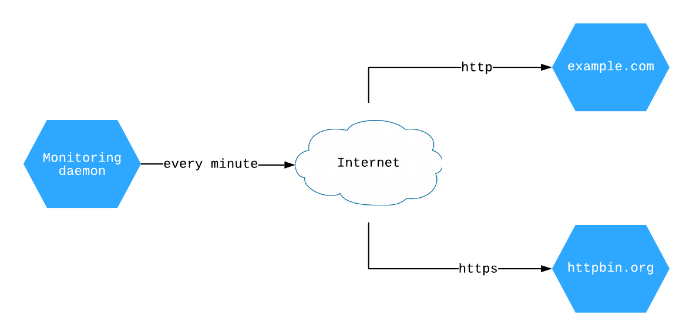

Asyncio daemon tutorial
=======================

.. _asyncio-daemon-tutorial:

This tutorials shows how to build an ``asyncio`` daemon following the dependency injection
principle.

We will use next tools:

- Python 3.8
- Docker
- Docker-compose

Start from the scratch or jump to the section:

.. contents::
   :local:
   :backlinks: none

You can find complete project on the
`Github <https://github.com/ets-labs/python-dependency-injector/tree/master/examples/miniapps/monitoring-daemon-asyncio>`_.

What are we going to build?
---------------------------

We will build a monitoring daemon that monitors web services availability.

The daemon will send the requests to the `example.com <http://example.com>`_ and
`httpbin.org <https://httpbin.org>`_ every minute. For each successfully completed
response it will log:

- The response code
- The amount of bytes in the response
- The time took to complete the response

Prerequisites
-------------

We will use `Docker <https://www.docker.com/>`_ and
`docker-compose <https://docs.docker.com/compose/>`_ in this tutorial. Let's check the versions:

.. code-block:: bash

   docker --version
   docker-compose --version

The output should look something like:

.. code-block:: bash

   Docker version 19.03.12, build 48a66213fe
   docker-compose version 1.26.2, build eefe0d31

.. note::

   If you don't have ``Docker`` or ``docker-compose`` you need to install them before proceeding.
   Follow these installation guides:

   - `Install Docker <https://docs.docker.com/get-docker/>`_
   - `Install docker-compose <https://docs.docker.com/compose/install/>`_

The prerequisites are satisfied. Let's get started with the project layout.

Project layout
--------------

Project layout starts with the project folder. It is also called the project root.

Create the project root folder and set it as a working directory:

.. code-block:: bash

   mkdir monitoring-daemon-tutorial
   cd monitoring-daemon-tutorial

Now we need to create the project structure. Create the files and folders following next layout.
All files should be empty for now. We will fill them in later.

Initial project layout:

.. code-block:: bash

   ./
   ├── monitoringdaemon/
   │   ├── __init__.py
   │   ├── __main__.py
   │   ├── containers.py
   │   └── dispatcher.py
   ├── docker-compose.yml
   ├── Dockerfile
   └── requirements.txt

The project layout is ready. Let's prepare the environment.

Prepare the environment
-----------------------

In this section we are going to prepare the environment.

First, we need to specify the project requirements. We will use next packages:

- ``dependency-injector`` - the dependency injection framework
- ``aiohttp`` - the web framework (we need only http client)
- ``pyyaml`` - the YAML files parsing library, used for the reading of the configuration files
- ``pytest`` - the testing framework
- ``pytest-asyncio`` - the helper library for the testing of the ``asyncio`` application
- ``pytest-cov`` - the helper library for measuring the test coverage

Put next lines into the ``requirements.txt`` file:

.. code-block:: bash

   dependency-injector
   aiohttp
   pyyaml
   pytest
   pytest-asyncio
   pytest-cov

Second, we need to create the ``Dockerfile``. It will describe the daemon's build process and
specify how to run it. We will use ``python:3.8-buster`` as a base image.

Put next lines into the ``Dockerfile`` file:

.. code-block:: bash

   FROM python:3.8-buster

   ENV PYTHONUNBUFFERED=1

   WORKDIR /code
   COPY . /code/

   RUN apt-get install openssl \
    && pip install --upgrade pip \
    && pip install -r requirements.txt \
    && rm -rf ~/.cache

   CMD ["python", "-m", "monitoringdaemon"]

Third, we need to define the container in the docker-compose configuration.

Put next lines into the ``docker-compose.yml`` file:

.. code-block:: yaml

   version: "3.7"

   services:

     monitor:
       build: ./
       image: monitoring-daemon
       volumes:
         - "./:/code"

All is ready. Let's check that the environment is setup properly.

Run in the terminal:

.. code-block:: bash

   docker-compose build

The build process may take a couple of minutes. You should see something like this in the end:

.. code-block:: bash

   Successfully built 5b4ee5e76e35
   Successfully tagged monitoring-daemon:latest

After the build is done run the container:

.. code-block:: bash

   docker-compose up

The output should look like:

.. code-block:: bash

   Creating network "monitoring-daemon-tutorial_default" with the default driver
   Creating monitoring-daemon-tutorial_monitor_1 ... done
   Attaching to monitoring-daemon-tutorial_monitor_1
   monitoring-daemon-tutorial_monitor_1 exited with code 0

The environment is ready. The application does not do any work and just exits with a code 0.

In the next section we will create the minimal application.

Minimal application
-------------------

HTTP monitor
------------

Add another monitor
-------------------

Tests
-----

Conclusion
----------

.. disqus::
