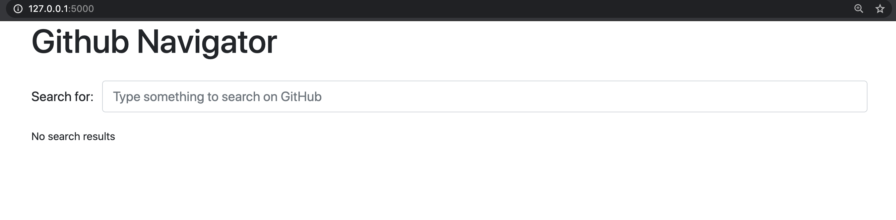

Flask tutorial
==============

This tutorials shows how to build ``Flask`` application following dependency injection principle.

What are we going to build?
---------------------------

We will build a web application that helps to search for repositories on the Github. Let's call it
Github Navigator.

How does Github Navigator work?

- User opens a web page that asks to provide a search term.
- User types the search term and hits Enter.
- Github Navigator takes that and searches through the Github for matching repositories.
- When search is done Github Navigator returns user a web page with the result.
- The results page shows all matching repositories and the provided search term.
- For any matching repository user sees:
    - the repository name
    - the owner of the repository
    - the last commit to the repository
- User can click on the repository, the repository owner or the last commit to open its web page
  on the Github.

Prepare the environment
-----------------------

Let's create the environment for the project.

First we need to create a project folder and the virtual environment:

.. code-block:: bash

   mkdir ghnav-flask-tutorial
   cd ghnav-flask-tutorial
   python3 -m venv venv

Now let's activate the virtual environment:

.. code-block:: bash

   . venv/bin/activate

Project layout
--------------

Environment is ready and now we're going to create the layout of the project.

Create next structure in the current directory. All files should be empty. That's ok for now.

Initial project layout::

   ./
   ├── githubnavigator/
   │   ├── __init__.py
   │   ├── application.py
   │   ├── containers.py
   │   └── views.py
   ├── venv/
   └── requirements.txt

Now it's time to install ``Flask`` and ``Dependency Injector``.

Put next lines to the ``requirements.txt`` file::

   dependency-injector
   flask

Now let's install it::

   pip install -r requirements.txt

And check that installation is successful::

   python -c "import dependency_injector; print(dependency_injector.__version__)"
   python -c "import flask; print(flask.__version__)"

You should see something like::

   (venv) $ python -c "import dependency_injector; print(dependency_injector.__version__)"
   3.22.0
   (venv) $ python -c "import flask; print(flask.__version__)"
   1.1.2

*Versions can be different. That's fine.*

Hello world!
------------

Let's create minimal application.

Put next to the ``views.py``:

.. code-block:: python

    """Views module."""

    def index():
        return 'Hello, World!'

Ok, we have the view.

Now let's create the heart of our application - the container. Container will keep all of the
application components and their dependencies. First two providers we need to add are
the ``Flask`` application provider and the view provider.

Put next to the ``containers.py``:

.. code-block:: python

    """Application containers module."""

    from dependency_injector import containers
    from dependency_injector.ext import flask
    from flask import Flask

    from . import views

    class ApplicationContainer(containers.DeclarativeContainer):
        """Application container."""

        app = flask.Application(Flask, __name__)

        index_view = flask.View(views.index)

Finally we need to create the Flask application factory. It is traditionally called
``create_app()``. It will create the container. Then it will use the container to create
the Flask application. Last step is to configure the routing - we will assign ``index_view`` from the
container to handle user requests to the root ``/`` if our web application.

Put next to the ``application.py``:

.. code-block:: python

    """Application module."""

    from .containers import ApplicationContainer

    def create_app():
        """Create and return Flask application."""
        container = ApplicationContainer()

        app = container.app()
        app.container = container

        app.add_url_rule('/', view_func=container.index_view.as_view())

        return app

.. note::

   Container is the first object in the application.

   The container is used to create all other objects.

Ok. Now we're ready to say "Hello, World!".

Do next in the terminal::

    export FLASK_APP=githubnavigator.application
    export FLASK_ENV=development
    flask run

The output should be something like::

    * Serving Flask app "githubnavigator.application" (lazy loading)
    * Environment: development
    * Debug mode: on
    * Running on http://127.0.0.1:5000/ (Press CTRL+C to quit)
    * Restarting with fsevents reloader
    * Debugger is active!
    * Debugger PIN: 473-587-859

Open your browser and go to the ``http://127.0.0.1:5000/``.

You should see ``Hello, World!``.

That's it. Our minimal application is up and running.

Make it pretty
--------------

Now let's make it look pretty. We will use `Bootstrap 4 <https://getbootstrap.com/>`_.
For adding it to our application we will get
`Bootstrap-Flask <https://pypi.org/project/Bootstrap-Flask/>`_ extension.
It will help us to add all needed static files in few clicks.

Add ``bootstrap-flask`` to the ``requirements.txt``::

   dependency-injector
   flask
   bootstrap-flask

and run in the terminal::

   pip install --upgrade -r requirements.txt

Now we need to add ``bootstrap-flask`` extension to the container.

Edit ``containers.py``:

.. code-block:: python
   :emphasize-lines: 6,16

    """Application containers module."""

    from dependency_injector import containers
    from dependency_injector.ext import flask
    from flask import Flask
    from flask_bootstrap import Bootstrap

    from . import views

    class ApplicationContainer(containers.DeclarativeContainer):
        """Application container."""

        app = flask.Application(Flask, __name__)

        bootstrap = flask.Extension(Bootstrap)

        index_view = flask.View(views.index)

Let's initialize ``bootstrap-flask`` extension. We will need to modify ``create_app()``.

Edit ``application.py``:

.. code-block:: python
   :emphasize-lines: 13-14

    """Application module."""

    from .containers import ApplicationContainer

    def create_app():
        """Create and return Flask application."""
        container = ApplicationContainer()

        app = container.app()
        app.container = container

        bootstrap = container.bootstrap()
        bootstrap.init_app(app)

        app.add_url_rule('/', view_func=container.index_view.as_view())

        return app

Now we need to add the templates. For doing this we will need to add the folder ``templates/`` to
the ``githubnavigator`` package. We also will need two files there:

- ``base.html`` - the layout
- ``index.html`` - the main page

Create ``templates`` folder and put two empty files into it ``base.html`` and ``index.html``:

.. code-block::
   :emphasize-lines: 3-5

   ./
   ├── githubnavigator/
   │   ├── templates/
   │   │   ├── base.html
   │   │   └── index.html
   │   ├── __init__.py
   │   ├── application.py
   │   ├── containers.py
   │   └── views.py
   ├── venv/
   └── requirements.txt

Now let's fill in the layout.

Put next to the ``base.html``:

.. code-block:: html

   <!doctype html>
   <html lang="en">
       <head>
           
           <!-- Required meta tags -->
           <meta charset="utf-8">
           <meta name="viewport" content="width=device-width, initial-scale=1, shrink-to-fit=no">

           
               <!-- Bootstrap CSS -->
               {{ bootstrap.load_css() }}
           

           <title></title>
           
       </head>
       <body>
           <!-- Your page content -->
           

           
               <!-- Optional JavaScript -->
               {{ bootstrap.load_js() }}
           
       </body>
   </html>

And put something to the index page.

Put next to the ``index.html``:

.. code-block:: html

   

   Github Navigator

   
   

       <h1 class="mb-4">Github Navigator</h1>

       

           <form>
               

                   <label for="search_term" class="col-form-label">Search for:</label>
                   

                       <input class="form-control" type="text" id="search_term"
                              placeholder="Type something to search on the GitHub"
                              name="search_term"
                              value="{{ search_term if search_term }}">
                   

               

           </form>
       

       
       
<small>No search results</small>

       

   

   

Ok, almost there. The last step is to make ``index`` view to render the ``index.html`` template.

Edit ``views.py``:

.. code-block:: python
   :emphasize-lines: 3,7

   """Views module."""

   from flask import render_template

   def index():
       return render_template('index.html')

That's it.

Make sure the app is running and open ``http://127.0.0.1:7000/``.

You should see:

Connect to the GitHub
---------------------

In this section we will integrate our application with Github API.

We will use `PyGithub <https://github.com/PyGithub/PyGithub>`_ library for working with Github API.

Let's add it to the ``requirements.txt``:

.. code-block::
   :emphasize-lines: 4

   dependency-injector
   flask
   bootstrap-flask
   pygithub

and run in the terminal::

   pip install --upgrade -r requirements.txt

Now we need to add Github API client the container. We will need to add two more providers from
the ``dependency_injector.providers`` module:

- ``Factory`` provider that will create ``Github`` client.
- ``Configuration`` provider that will be used for providing the API token and the request timeout
  for the ``Github`` client.

Let's do it.

Edit ``containers.py``:

.. code-block:: python
   :emphasize-lines: 3,7,19,21-25

   """Application containers module."""

   from dependency_injector import containers, providers
   from dependency_injector.ext import flask
   from flask import Flask
   from flask_bootstrap import Bootstrap
   from github import Github

   from . import views

   class ApplicationContainer(containers.DeclarativeContainer):
       """Application container."""

       app = flask.Application(Flask, __name__)

       bootstrap = flask.Extension(Bootstrap)

       config = providers.Configuration()

       github_client = providers.Factory(
           Github,
           login_or_token=config.github.auth_token,
           timeout=config.github.request_timeout,
       )

       index_view = flask.View(views.index)

.. note::

   We have used the configuration value before it was defined. That's the principle how
   ``Configuration`` provider works.

   Use first, define later.

Now let's add the configuration file.

We will use YAML.

Create an empty file ``config.yml`` in the root root of the project:

.. code-block::
   :emphasize-lines: 11

   ./
   ├── githubnavigator/
   │   ├── templates/
   │   │   ├── base.html
   │   │   └── index.html
   │   ├── __init__.py
   │   ├── application.py
   │   ├── containers.py
   │   └── views.py
   ├── venv/
   ├── config.yml
   └── requirements.txt

and put next into it::

   github:
     request_timeout: 10

We will use `PyYAML <https://pypi.org/project/PyYAML/>`_ library for parsing the configuration
file. Let's add it to the requirements file.

Edit ``requirements.txt``:

.. code-block::
   :emphasize-lines: 5

   dependency-injector
   flask
   bootstrap-flask
   pygithub
   pyyaml

and install it::

   pip install --upgrade -r requirements.txt

We will use environment variable ``GITHUB_TOKEN`` to provide the API token.

Now we need to edit ``create_app()`` to make two things when application starts:

- Load the configuration file the ``config.yml``.
- Load the API token from the ``GITHUB_TOKEN`` environment variable.

Edit ``application.py``:

.. code-block:: python
   :emphasize-lines: 9-10

   """Application module."""

   from .containers import ApplicationContainer

   def create_app():
       """Create and return Flask application."""
       container = ApplicationContainer()
       container.config.from_yaml('config.yml')
       container.config.github.auth_token.from_env('GITHUB_TOKEN')

       app = container.app()
       app.container = container

       bootstrap = container.bootstrap()
       bootstrap.init_app(app)

       app.add_url_rule('/', view_func=container.index_view.as_view())

       return app

Now we need create an API token.

As for now, don't worry, just take this one:

.. code-block:: bash

   export GITHUB_TOKEN=cbde697a6e01424856fde2b7f94a88d1b501320e

.. note::

   To create your own token:

   - Follow the `Github guide <https://docs.github.com/en/github/authenticating-to-github/creating-a-personal-access-token>`_.
   - Set the token to the environment variable:

   .. code-block:: bash

      export GITHUB_TOKEN=<your token>

That's it.

Github API client setup is done.

Tests
-----

Conclusion
----------
