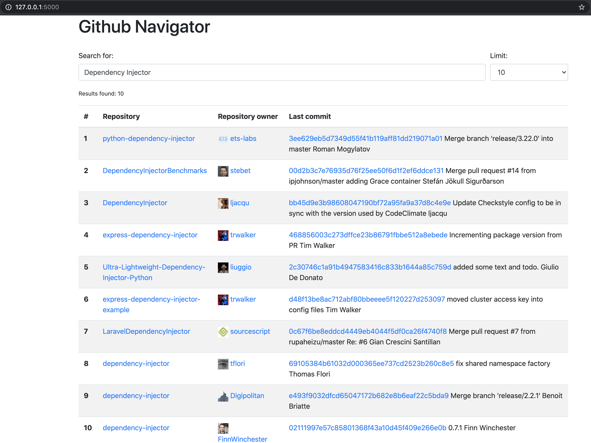

Flask Dependency Injection Example
==================================

Application ``githubnavigator`` is a `Flask <https://flask.palletsprojects.com/>`_ +
`Dependency Injector <http://python-dependency-injector.ets-labs.org/>`_ application.

Run
---

Create virtual environment:

.. code-block:: bash

   virtualenv venv
   . venv/bin/activate

Install requirements:

.. code-block:: bash

    pip install -r requirements.txt

To run the application do:

.. code-block:: bash

    export FLASK_APP=githubnavigator.application
    export FLASK_ENV=development
    flask run

The output should be something like:

.. code-block::

    * Serving Flask app "githubnavigator.application" (lazy loading)
    * Environment: development
    * Debug mode: on
    * Running on http://127.0.0.1:5000/ (Press CTRL+C to quit)
    * Restarting with fsevents reloader
    * Debugger is active!
    * Debugger PIN: 473-587-859

After that visit http://127.0.0.1:5000/ in your browser.

.. note::

   Github has a rate limit. When thre rate limit is exceed you will see an exception
   ``github.GithubException.RateLimitExceededException``. For unauthenticated requests, the rate
   limit allows for up to 60 requests per hour. To extend the limit to 5000 requests per hour you
   need to set personal access token.

   It's easy:

   - Follow this `guide <https://docs.github.com/en/github/authenticating-to-github/creating-a-personal-access-token>`_ to create a token.
   - Set a token to the environment variable:

   .. code-block:: bash

      export GITHUB_TOKEN=<your token>

   - Restart the app with ``flask run``

   `Read more on Github rate limit <https://developer.github.com/v3/#rate-limiting>`_

Test
----

This application comes with unit tests.

To run the tests do:

.. code-block:: bash

   py.test githubnavigator/tests.py --cov=githubnavigator

The output should be something like:

.. code-block::

   platform darwin -- Python 3.8.3, pytest-5.4.3, py-1.9.0, pluggy-0.13.1
   plugins: flask-1.0.0, cov-2.10.0, asyncio-0.14.0
   collected 2 items

   githubnavigator/tests.py ..                                     [100%]

   ---------- coverage: platform darwin, python 3.8.3-final-0 -----------
   Name                             Stmts   Miss  Cover
   ----------------------------------------------------
   githubnavigator/__init__.py          0      0   100%
   githubnavigator/application.py       8      0   100%
   githubnavigator/containers.py       11      0   100%
   githubnavigator/services.py         14      0   100%
   githubnavigator/tests.py            33      0   100%
   githubnavigator/views.py             7      0   100%
   ----------------------------------------------------
   TOTAL                               73      0   100%
